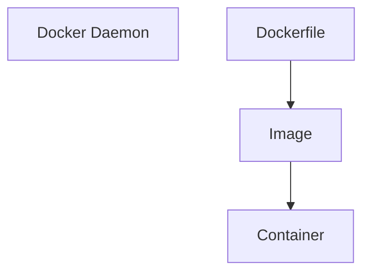

> [!example] Functions
> - listening to [[Docker API]] requests
> - managing Docker objects ([[Docker images|images]],[[Docker containers|containers]], [[Docker networks|networks]], and [[Docker volumes|volumes]])
> - communicating with other [[daemon]]s for managing services

