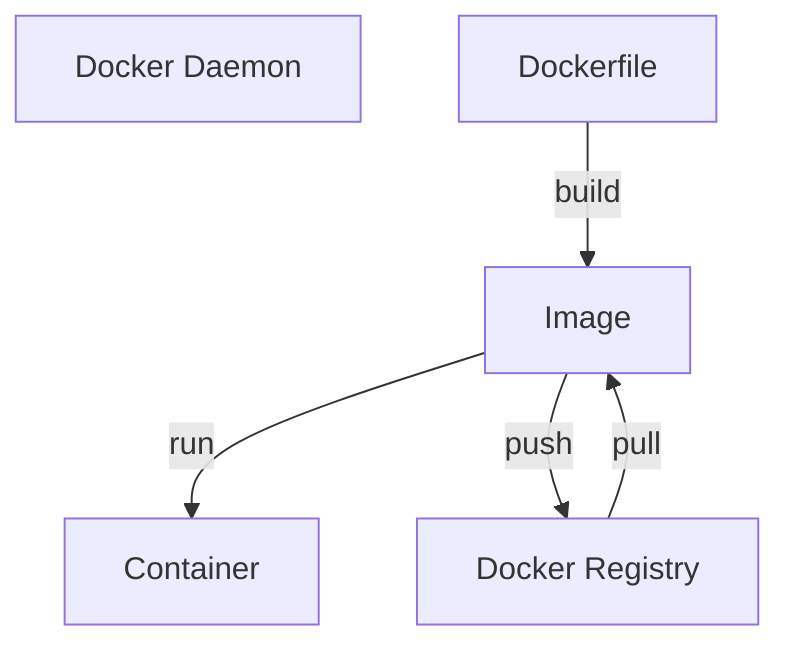

> [!tldr]
> **Docker** — це відкрита платформа для розробки, доставки та запуску програм.

**Docker** дозволяє вам відокремити ваші програми від інфраструктури, щоб ви могли [[CD|швидко доставляти програмне забезпечення]]. За допомогою **Docker** ви можете керувати своєю інфраструктурою так само, як ви керуєте своїми програмами.

## Архітектура

Архітектура Docker — це [[Клієнт-серверна архітектура]]:

1. Команди Docker виконуються через інструмент CLI Docker.
2. [[Docker Client]]] взаємодіє з [[Docker daemon|демоном]] за допомогою [[REST API]] через [[сокет]] UNIX або мережевий інтерфейс.
3. Демон виконує роботу зі створення, запуску та розповсюдження контейнерів поза клієнтом Docker.
4. Демон звертається до [[Реєстр Docker|реєстру Docker]], щоб отримати потрібний образ.

