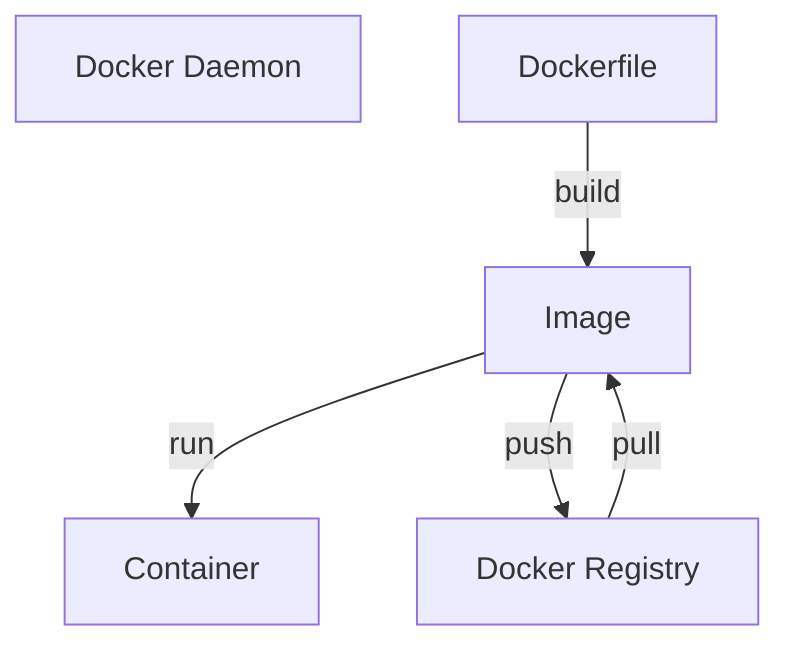

> [!tldr]
> **Docker** is an open platform for developing, shipping, and running applications.

**Docker** allows you to separate your applications from your infrastructure so you can [[Continuous delivery|deliver software quickly]]. With **Docker**, you can manage your infrastructure in the same ways you manage your applications.

## Architecture

Docker architecture is a [[Client-Server architecture]]:

1. docker commands are run via [[docker cli|CLI Docker tool]].
2. the [[Docker Client]] communicates with daemon using [[REST API]] over a UNIX [[сокет|socket]] or network interface.
3. The daemon does the work on building, running and distributing containers outside docker client
4. The daemon goes to the [[Docker Registry]] to get the needed image.

> [!note] Another docker client is [[Docker Compose]]

