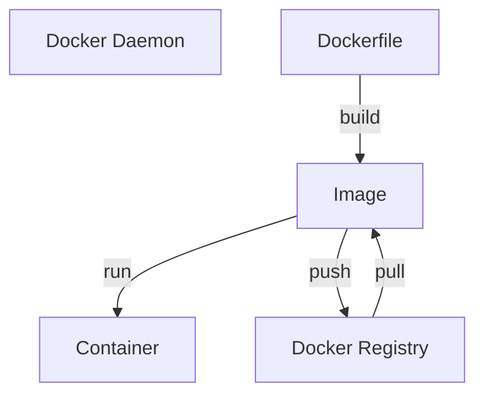

> [!tldr]
> **Docker** is an open platform for developing, shipping, and running applications.

**Docker** allows you to separate your applications from your infrastructure so you can [[Continuous delivery|deliver software quickly]]. With **Docker**, you can manage your infrastructure in the same ways you manage your applications.

## Architecture

Docker architecture is a [[Client-Server architecture]]:

1. 

