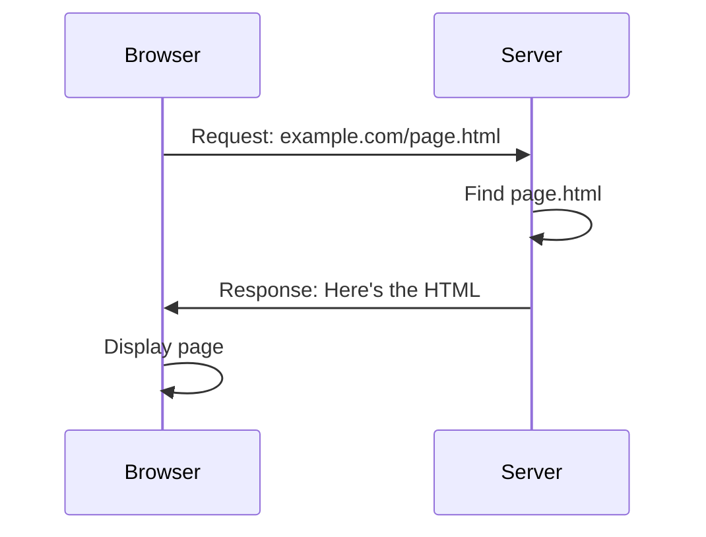

1. Користувач вводить URL у браузер
2. DNS перетворює URL у IP-адресу
3. Клієнт надсилає запит
4. Сервер знаходить потрібний ресурс
5. Сервер надсилає ресурс клієнту
6. Браузер відображає результат

